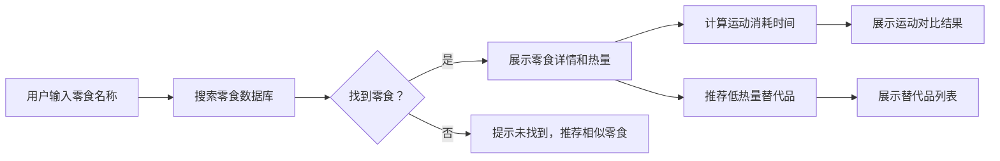

## 1. 产品概述

零食热量消耗计算器网站，帮助用户查询零食的热量信息、计算需要多少运动才能消耗，并推荐低热量替代品。

- **主要目的**：帮助用户了解零食的热量代价，做出更健康的饮食选择
- **解决问题**：用户不知道零食的具体热量，也不知道需要多少运动才能消耗
- **目标用户**：关注健康饮食、想要控制体重的人群
- **市场价值**：提供实用的健康工具，帮助用户建立健康饮食习惯

## 2. 核心功能

### 2.1 用户角色

| 角色 | 注册方式 | 核心权限 |
|------|----------|----------|
| 普通用户 | 无需注册 | 搜索零食、查看热量信息、查看运动消耗、查看替代品推荐 |

### 2.2 功能模块

1. **首页**：搜索框、热门零食推荐、使用说明
2. **搜索结果页**：零食详情、热量信息、运动消耗对比、替代品推荐

### 2.3 页面详情

| 页面名称 | 模块名称 | 功能描述 |
|----------|----------|----------|
| 首页 | 搜索区域 | 支持输入零食名称搜索，支持联想提示 |
| 首页 | 热门零食 | 展示常见零食快捷入口 |
| 结果页 | 零食详情 | 展示零食名称、份量、热量、营养成分 |
| 结果页 | 运动消耗 | 以直观对比方式展示需要的运动量（如：一袋薯片 = 爬楼梯15分钟） |
| 结果页 | 替代品推荐 | 推荐2-3个热量更低的同类零食 |

## 3. 核心流程

用户在首页搜索框输入零食名称 → 系统匹配零食数据 → 展示零食详情和热量 → 计算并展示各种运动需要的时间 → 推荐低热量替代品

## 4. 用户界面设计

### 4.1 设计风格

- **主色调**：清新绿色（代表健康）#10b981
- **辅助色**：温暖橙色（代表食物）#f97316
- **中性色**：白色、浅灰、深灰
- **按钮风格**：圆角、渐变、悬停有阴影和缩放效果
- **字体**：展示字体用 Poppins，正文字体用 Inter
- **布局风格**：卡片式布局，柔和阴影，大量留白
- **图标风格**：Lucide 线性图标，简洁现代

### 4.2 页面设计概述

| 页面名称 | 模块名称 | UI 元素 |
|----------|----------|----------|
| 首页 | Hero 区域 | 大标题、搜索框、简短说明、渐变色背景 |
| 首页 | 热门零食 | 横向滚动卡片，点击即可查询 |
| 结果页 | 零食信息卡 | 大卡片，显示零食名称、份量、热量数值 |
| 结果页 | 运动对比区 | 图标 + 文字，直观展示运动时间 |
| 结果页 | 替代品区 | 卡片列表，显示替代品名称、热量对比 |

### 4.3 响应式

- 桌面端优先设计
- 移动端自适应布局
- 触摸设备优化按钮和输入框大小
- 搜索结果在移动端垂直堆叠

