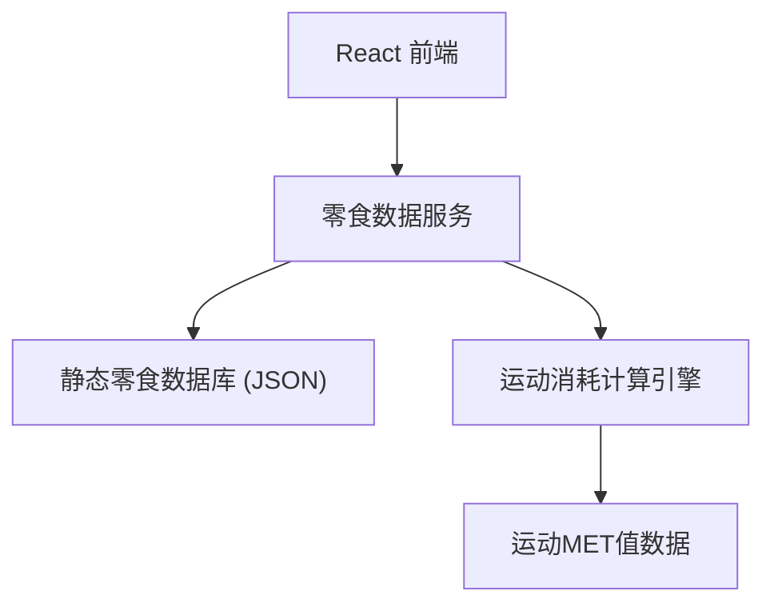

## 1. 架构设计



## 2. 技术描述

- **前端**：React@18 + TypeScript + Tailwind CSS@3 + Vite
- **初始化工具**：vite-init
- **后端**：无（纯前端应用，数据静态存储）
- **数据库**：JSON 文件存储零食和运动数据
- **图标库**：lucide-react

## 3. 路由定义

| 路由 | 用途 |
|------|------|
| / | 首页，包含搜索框和热门零食 |
| /snack/:id | 零食详情页，展示热量、运动消耗、替代品 |

## 4. 数据模型

### 4.1 零食数据结构

```typescript
interface Snack {
  id: string;
  name: string;
  category: string;
  servingSize: string;
  calories: number;
  protein: number;
  fat: number;
  carbs: number;
  image?: string;
}
```

### 4.2 运动数据结构

```typescript
interface Exercise {
  id: string;
  name: string;
  icon: string;
  metValue: number; // 代谢当量
}
```

### 4.3 计算逻辑

```
运动时间（分钟）= (零食热量 × 体重系数) / (MET值 × 3.5 × 体重 / 200)
默认体重：65kg
```

## 5. 项目结构

```
src/
├── components/       # 可复用组件
│   ├── SearchBar.tsx
│   ├── SnackCard.tsx
│   ├── ExerciseCard.tsx
│   └── AlternativeCard.tsx
├── data/             # 静态数据
│   ├── snacks.ts     # 零食数据库
│   └── exercises.ts  # 运动数据库
├── pages/            # 页面组件
│   ├── Home.tsx
│   └── SnackDetail.tsx
├── utils/            # 工具函数
│   └── calculator.ts # 热量计算逻辑
├── App.tsx
└── main.tsx
```

